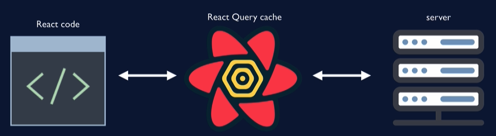
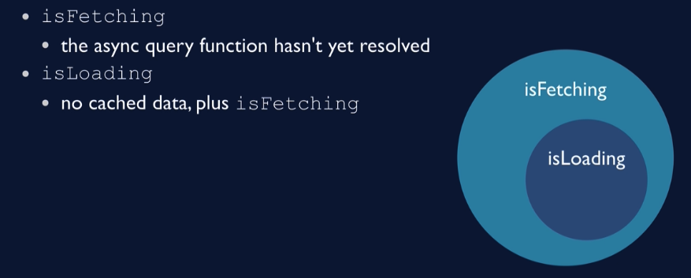

# react-query-server-state-management

## What problem does React Query solve?

- `React Query` maintains cache of server data on client
- 它在客户端帮我们维护服务端的缓存
  - when you fetch server data, do it via `React Query`
  - 当你加载服务端数据时，需要通过它
- Your job: let `React Query` know when to refresh
- 你的任务就是：让它知道啥时候该刷新服务端数据
  - immediately, by invalidating data
  - 是立即就刷新吗？是的话你就直接让数据 **“失效”**
  - marking data as stale and configuraing refetch triggers
  - 然后它会讲数据标记为 “陈旧的”和重新触发请求服务端数据

> Bonnie Schulkin is a **Great Techer** ！
>
> Bonnie 讲得明明白白！
>
> 我也看过 `React Query` 作者自己出的教程，真心话还没 **Bonnie** 讲得明白！！



此次之外，还新增如下功能：


## First Project! Blog-em Ipsum

- Gets data from `https://jsonplaceholder.typicode.com/`
- Very simply, focus on React Query concepts
- 虽然很简单，但请专注于用 React Query 的概念来解决问题
  - Fetching data
  - Loading /error states
  - Reac Query dev tools
  - Pagination
  - Prefetching
  - Mutations

## Getting Started

- Create query client
  - Client that manages queries and cache
- Apply Query Provider
  - Provides cache and client config to children
  - Takes query clients as the value
- Run useQuery
  - Hook that queries the server

## isFetching vs. isLoading



## Dev Tools

- Shows queries (by keys)
  - status of queryies
  - last updated timestamp
- Data explorer
- Query exporer

## Stale Data

- Why does it matter if the data is stale?
- 为什么说数据过期是重要的？
- Data refetch only triggers for stale data
- 其实数据重新加载只针对陈旧数据来触发
  - For example, component remount, window refocus
  - `staleTime` translates to "max age"
  - How to tolerate data potentially being out of date?
  - 如何容忍数据可能过期的情况？

## Why is default staleTime set to 0?


- How is the data on the screen always up to date?
- is a much better question be asking than
- Why is my data not updating?

> 如何保证屏幕上的数据始终是最新的？
>
> 其实应该问：为什么我的数据不更新？ --> staleTime set to 0

## staleTime vs. cacheTime


> 一个扫帚就能带代表这两者区别,配图有点 👍

- `staleTime` is for re-fetching
- `staleTime` 代表着重新远程加载数据
- Cache is for data the might be re-used later
- 缓存却代表着数据可能在稍后被再次使用
  - query goes into "cold stroage" if there's no active `useQuery`
  - cache data expires after `cacheTime` (default: five minutes)
  - 缓存数据将在 `cacheTime` 时间后过期
    - how long it's been since the last active `useQuery`
    - `cacheTime`到底啥意思？就是说这个数据的生产者 `useQuery` 是在多长时间前调用的？
    - 也就是说 `useQuery` 被调用后会记录时间，这个时间与 `cacheTime` 比对就确定是否清理缓存
  - After the cache expires, the data is garbage collected
  - 当缓存过期后，数据将被垃圾回收 ♻️
- Cache is backup data to display while fetching
- 缓存是一份备份的数据，在远程加载数据时，用它去显示

## Why don't comments refresh?

```ts
const { data, isLoading, isError, error } = useQuery("comments", () =>
  fetchComments(post.id)
);
```

这是因为

- Every query uses the same key (“`comments`”)
- Data for queries with known keys only refetched upon trigger
- 其实很简单，已知 key 的异步查询更新，仅仅只在 `refetched` 再次查询更新 时触发
- 看底下有 `refetched` 的触发条件
- Example tirggers:
  - component remount 组件再次挂载
  - window refocus 窗口再次被被聚焦
  - running refetch function 手动运行 refetch 函数
  - automated refetch 设置了自执行的 refetch
  - query invalidation after a mutation 使用 mutation 让数据失效 invalidation

## Array as Query Key

- Pass array for the query key, not just a string
- Treat the query key as a dependency array
- 把查询件作为一个依赖数组
  - When key changes, create a new query
  - 当他们任一一个变化时，就发起一个新的查询
- Query Function values should be part of the key

- `['comments', post.id]`

## Pagination

- Track current page in components state (currentPage)
- Use query keys that include the page number ["posts", currentPage]
- Use clicks "next page" or "previous page" button
  - update currentPage state
  - fire off new query

```ts
// 基操分类
const { data, error, isLoading, isError } = useQuery(
  ["posts", currentPage],
  () => fetchPosts(currentPage),
  {
    staleTime: 2000,
  }
);
```

## Prefetching


> 用来做啥呢 ❓

- adds data to cache
- 提前把数据放到缓存里，增强体验
- automatically stale (configurable)
- 通过配置自动将数据变陈旧
- shows while re-fetching
- 在二次加载时还有数据可显示
  - as long as cache hasn't expired!
  - 前提条件是缓存没过期
- Prefetching can be used for any anticipated data needs
  - not just pagination!
  - 预加载可以用于任何数据获取的场景，不仅仅是分页！

> c2-06 0:0

## Mutations

- Mutation: making a network call that changes data on the server
- 调用一个网络请求去改变数据，从服务器拉取数据
  - jsonplaceholder API does'n change server
  - go through the mechanince of making the change
  - 这里机械方式的更新 应该是要强调更新的力度，是不说二话的更新吧
- Day Spa app will demonstrate showing changes to user
- Mutation 到底是用来做啥子的？
  - Optimistic updates (assume change will happen)
  - 啥子是乐观更新 (假设请求是成功的)
  - Update React Query cache with data returned from the server
  - 更新缓存使用服务端返回的数据
  - Trigger re-fetch of relevant data (invalidation)
  - 使用 invalidation，触发再加载更新相关数据

## useMutation

- Similar to useQuery, but:
  - returs `mutate` function
  - doesn't need query key
  - isLoading, but no isFetching
  - by default, no retries (configurable!)
  - 默认情况没有 重试机制，但可以配置！

## Blog-em Ipsum Summary

> 👍

- Install package, create QueryClient and add QueryProvider
- `useQuery` for data
  - return object also includes `isLoading` / `isFetching` and `error`
- `staleTime` for whether or not to re-fetch (no trigger)
- `cacheTime` for how long to hold on to data after inactivity
- query keys as dependency arrays
- pagination and pre-fetching
- `useMutation` for server side-effects

## Infinite SWAPI

- Infinite scroll
  - fetch new data "just time" as user scrolls
  - more efficient than fetching all data at once
- Fetch new data when...
  - user clicks a button
  - user scrolls to certain point on the page

## useInfiniteQuery

- Requires different API format than pagination
- Hence new project!
- Pagination
  - track current page in component state
  - new query updates page number
- `useInfiniteQuery` tracks next query 最终下一次查询
  - next query is returned as part of the data
  - 下一次查询数据被返回在这次查询的一个字段里
  - 格式如下：

```json
{
  "count": 37,
  "next": "http://swapi.dev/api/species/?page=2",
  "previous": null,
  "result": " [ ... ] "
}
```

Shape of useInfiniteQuery Data

- Shape of data different than `useQuery`
- Object with two properties:
  - `pages`
  - `pageParams`
- Every query has its own element in the `pages` array
- `pageParams` tracks the keys of queries that have been retrieved
  - rarely used, won't use here

useInfiniteQuery Syntax

- `pageParam` is a parameter passed to the queryFn
  - `useInfiniteQuery("sw-people", ({ pageParam = defaultUrl }) => fetchUrl(pageParam)`
  - Current value of `pageParam` is maintained by React-Query
- useInfiniteQuery options
  - getNextPageParam: (lastPage, allPages)
    - Updates `pageParam`
    - Migth use all of the page of data (allPages)
    - we will use just the `lastPage` of data (specifically the `next` property)

> 看来有必要根据相对合适的数据结构，重构下无限加载的接口。

React Infinite Scroller

- Works really nicely with useInfiniteQuery
- Populate two props for InfiniteScroll compoent:
  - loadMore = {fetchNextPage}
  - hasMore = {hasNextPage}
- Component takes care of datecting when to load more
- `Data in data.pages[x].results`

Infinite Scroll Summary

- React Query manages
  - pageParam for next page to be fetched
    - getNextPageParam option
    - cloud be from lastPage, or allPage
  - hasNextPage
    - boolean indicating whether `pageParam` is `undefined`
- Component handles calling fetchNextPage
  - use hasNextPage value to determin when to stop

React Query in Larger App

> React-Query 怎么用在大型项目

- centralizing fetching indicator / error handling
- 配置中心化的fetching函数和集中处理请求错误
- refetching data
- 配置失败重加载数据机制
- integrating with auth
- 集成授权机制
- dependent queries
- testing
- more examples of `useQuery`, muatation, pagination, prefetching

Including Dev Tools

- Dev tools are smart!
  - don't show when process.env.NODE_ENV === "prodction"
- For create-react-app `npm start` runs with NODE_ENV = "development"
- dev tools won't appear when app is built
  - NODE_ENV = 'prodction'
