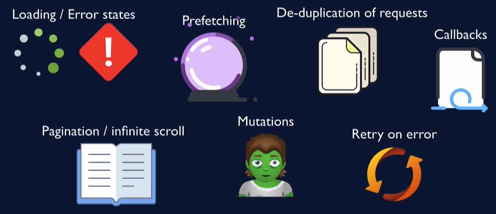

# react-query-server-state-management

What problem does React Query solve?

- `React Query` maintains cache of server data on client
- 它在客户端帮我们维护服务端的缓存
  - when you fetch server data, do it via `React Query`
  - 当你加载服务端数据时，需要通过它
- Your job: let `React Query` know when to refresh
- 你的任务就是：让它知道啥时候该刷新服务端数据
  - immediately, by invalidating data
  - 是立即就刷新吗？是的话你就直接让数据 **“失效”**
  - marking data as stale and configuraing refetch triggers
  - 然后它会讲数据标记为 “陈旧的”和重新触发请求服务端数据

> Bonnie Schulkin is a **Great Techer** ！
>
> Bonnie 讲得明明白白！
>
> 我也看过 `React Query` 作者自己出的教程，真心话还没 **Bonnie** 讲得明白！！


此次之外，还新增如下功能：



## First Project! Blog-em Ipsum

- Gets data from `https://jsonplaceholder.typicode.com/`
- Very simply, focus on React Query concepts
- 虽然很简单，但请专注于用 React Query 的概念来解决问题
  - Fetching data
  - Loading /error states
  - Reac Query dev tools
  - Pagination
  - Prefetching
  - Mutations

Getting Started

- Create query client
  - Client that manages queries and cache
- Apply Query Provider
  - Provides cache and client config to children
  - Takes query clients as the value
- Run useQuery
  - Hook that queries the server

isFetching vs. isLoading


Dev Tools

- Shows queries (by keys)
  - status of queryies
  - last updated timestamp
- Data explorer
- Query exporer

Stale  Data

- Why does it matter if the data is stale?
- 为什么说数据过期是重要的？
- Data refetch only triggers for stale data
- 其实数据重新加载只针对陈旧数据来触发
  - For example, component remount, window refocus
  - `staleTime` translates to "max age"
  - How to tolerate data potentially being out of date?
  - 如何容忍数据可能过期的情况？

Why is default staleTime set to 0?


- How is the data on the screen always up to date?
- is a much better question be asking than
- Why is my data not updating?

> 如何保证屏幕上的数据始终是最新的？
>
> 其实应该问：为什么我的数据不更新？ --> staleTime set to 0

staleTime vs. cacheTime


> 一个扫帚就能带代表这两者区别,配图有点 👍

- `staleTime` is for re-fetching
- `staleTime` 代表着重新远程加载数据
- Cache is for data the might be re-used later
- 缓存却代表着数据可能在稍后被再次使用
  - query goes into "cold stroage" if there's no active `useQuery`
  - cache data expires after `cacheTime` (default: five minutes)
  - 缓存数据将在 `cacheTime` 时间后过期
    - how long it's been since the last active `useQuery`
    - `cacheTime`到底啥意思？就是说这个数据的生产者 `useQuery` 是在多长时间前调用的？
    - 也就是说 `useQuery` 被调用后会记录时间，这个时间与 `cacheTime` 比对就确定是否清理缓存
  - After the cache expires, the data is garbage collected
  - 当缓存过期后，数据将被垃圾回收♻️
- Cache is backup data to display while fetching
- 缓存是一份备份的数据，在远程加载数据时，用它去显示

Why don't comments refresh?

```ts
const { data, isLoading, isError, error } = useQuery("comments", () =>
  fetchComments(post.id)
);
```

这是因为

- Every query uses the same key (“`comments`”)
- Data for queries with known keys only refetched upon trigger
- 其实很简单，已知 key 的异步查询更新，仅仅只在 `refetched` 再次查询更新 时触发
- 看底下有 `refetched` 的触发条件
- Example tirggers:
  - component remount 组件再次挂载
  - window refocus 窗口再次被被聚焦
  - running refetch function 手动运行 refetch 函数
  - automated refetch 设置了自执行的 refetch
  - query invalidation after a mutation 使用 mutation 让数据失效 invalidation
